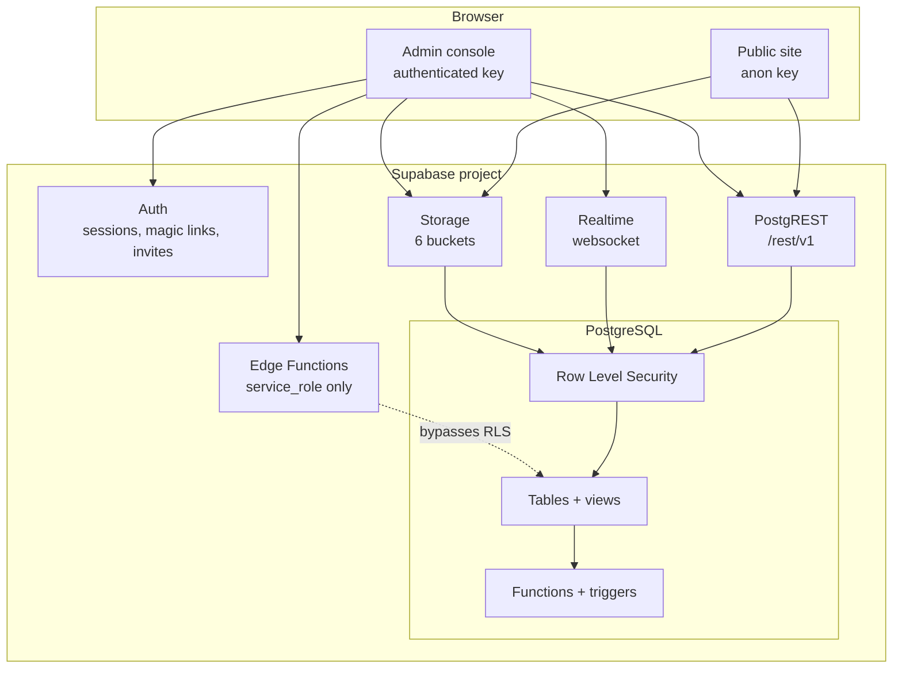

# Architecture

React + TypeScript + Vite talking directly to Supabase. There is no application
server: PostgreSQL, its policies and its functions *are* the backend.

---

## Shape of the system



Every arrow from the browser passes through RLS. The only path that bypasses it
is an Edge Function holding the `service_role` key, and those functions verify
the caller's role before doing anything.

---

## Layers

```
Component  →  Hook (TanStack Query)  →  Repository (features/*/api)  →  Supabase
```

The rule that keeps this honest: **`src/lib/supabase.ts` is imported only by
per-feature `api` folders.** No component, page or layout imports the Supabase
client. Consequences:

- Every query has a cache key from one factory, so invalidation is provable.
- Every error passes through `toAppError`, so the UI sees one error shape.
- Swapping or mocking the data layer touches one folder, not two hundred call
  sites.

---

## Folder structure

```
src/
  app/            router, providers, guards, error boundary, env gate
  lib/            supabase client, env validation, query keys/client,
                  error translation, zodResolver
  types/          database.types.ts — the schema contract
  contexts/       AuthContext, ThemeContext
  hooks/          cross-feature hooks (useDebouncedValue)
  utils/          cn, format, constants (enum display metadata)

  components/
    ui/           Button, Field, Badge, Card, Modal, Toast, Feedback
    DataTable, PageHeader, Sidebar, Topbar, Logo

  layouts/        PublicLayout, AuthLayout, DashboardLayout

  features/
    auth/ applicants/ personnel/ branches/ deployments/
    users/ notifications/ reports/ settings/
      api/        repository functions — the only Supabase callers
      hooks/      TanStack Query wrappers
      components/ feature-specific UI
      schemas/    Zod schemas shared by form and API

  pages/
    public/       Home, Services, Careers, About, Contact, Apply, Status
    auth/         Login, ForgotPassword, ResetPassword, AuthCallback
    admin/        Dashboard, Applicants(+detail), Personnel(+detail),
                  Branches, Deployments, Users, Audit, Reports,
                  Settings, Profile,
                  Configuration (layout route) -> Positions, Ranks

supabase/
  migrations/     0001–0011, applied in order
  seed/           reference data (roles, permissions, settings, branches)
  sql/            one-off operational scripts (bootstrap_owner.sql)
  functions/      Edge Functions (Deno)

docs/
```

---

## Provider stack

Order in `src/app/providers.tsx` is deliberate:

```
ErrorBoundary      must survive a crash in anything below
 └ EnvGate         short-circuits before any provider reaches for Supabase
    └ ThemeProvider   sets the `.dark` class before first paint
       └ QueryClientProvider
          └ AuthProvider    clears the query cache on sign-out
             └ ToastProvider
```

`EnvGate` is what lets the app boot with no Supabase credentials: instead of a
white screen and an opaque network error, it renders setup instructions naming
the missing variables.

---

## Routing

`createBrowserRouter` with every page behind `React.lazy`, so a visitor to the
public site never downloads the admin bundle. `<Suspense>` lives in the layouts,
so each route group falls back to its own skeleton.

```
/                    PublicLayout    home, services, careers, about, contact
/apply, /status      PublicLayout    applicant portal
/auth/*              AuthLayout      login, forgot, reset, callback
/admin/*             ProtectedRoute → DashboardLayout
/admin/config        ConfigurationPage (layout route)
  ├ /positions       PositionsPage
  └ /ranks           RanksPage
```

`/admin/config` is a **layout route**: the hub owns the page header and the
section tabs, and each section renders through its `<Outlet />`. Nesting rather
than flattening means every tab keeps its own URL — so a link to
`/admin/config/ranks` still lands on the right tab — while each section
paginates and lazy-loads independently. Adding a new kind of reference data is
one more child route, not one more top-level sidebar entry.

`ProtectedRoute` handles three states, not two: loading, unauthenticated, and
**authenticated-but-unprovisioned** — an account with a valid session but no
active profile or role grant. That last case gets a clear "ask an administrator"
screen rather than an empty dashboard where every query returns nothing.

---

## Data fetching

Defaults in `src/lib/queryClient.ts`:

- `staleTime: 30s`, `gcTime: 5min` — an internal dashboard, not a ticker
- `refetchOnWindowFocus: false` — alt-tabbing should not re-query
- Retry twice, except on `42501` (RLS denial), `PGRST301` (expired session),
  `PGRST116` (no rows) and `23505` (unique violation). RLS said no; it will keep
  saying no.
- Mutations never retry — a failed write must surface, not silently replay
  against a server that may have partially applied it.

Lists are paginated server-side via `.range()`, filtered via `.eq()`/`.or()`, and
sorted via `.order()`. Nothing is sorted or sliced in the browser, because RLS
means the client never holds the full set anyway.

---

## Realtime

One subscription per admin session, opened by `DashboardLayout`:

```ts
supabase.channel(`notifications:${user.id}`)
  .on('postgres_changes',
      { event: '*', schema: 'public', table: 'notifications',
        filter: `user_id=eq.${user.id}` },
      () => queryClient.invalidateQueries({ queryKey: queryKeys.notifications.all }))
```

Two choices worth noting:

- The **server-side filter** matters. RLS would discard other users' rows
  anyway, but the filter avoids sending them at all.
- It **invalidates rather than merging the payload** into the cache. One source
  of truth for ordering and unread counts is worth the extra round trip.

---

## Design system

Tailwind v4 via `@tailwindcss/vite` — no `tailwind.config.js`, no PostCSS. Brand
tokens are declared in `@theme` in `src/styles/index.css`.

Components reference **semantic** variables (`--app-surface`, `--app-text`,
`--app-border`), not raw palette values. Dark mode flips those variables under a
`.dark` class, so it costs nothing per component. Theme preference is
light/dark/system, persisted to localStorage.

House style: black sidebar, white content, red accents, 12px card radius, flat
corporate shadows, Inter self-hosted via `@fontsource` (the CSP forbids external
font hosts). Deliberately not: glassmorphism, neon, cyberpunk, startup-SaaS.

Accessibility is built into the primitives rather than bolted on: `<Field>` owns
the id wiring so every control is labelled and every error is announced;
`<Modal>` traps focus, restores it on close and handles Escape; the toast
viewport is an `aria-live` region with errors as `role="alert"`; status is always
conveyed by text as well as colour.

---

## Where the business rules live

Deliberately in the database, because the UI can be bypassed:

| Rule | Enforced by |
|---|---|
| Applicants must be 18+ | `applicants_age_chk` |
| A rejection needs a reason | `applicants_rejection_reason_chk` |
| Only legal pipeline moves | `validate_applicant_transition()` trigger |
| No double-booked guards | `deployments_no_overlap` exclusion constraint |
| Hire only from `interview` | `promote_applicant_to_personnel()` |
| Separation date consistency | `personnel_status_consistency_chk` |
| Who can read or write what | RLS policies |

The frontend mirrors several of these — `APPLICANT_TRANSITIONS` in
`src/utils/constants.ts`, the Zod schemas — but only so the user gets fast,
readable feedback. When the two disagree, the database wins, and
`src/lib/errors.ts` translates its constraint names into plain language.
