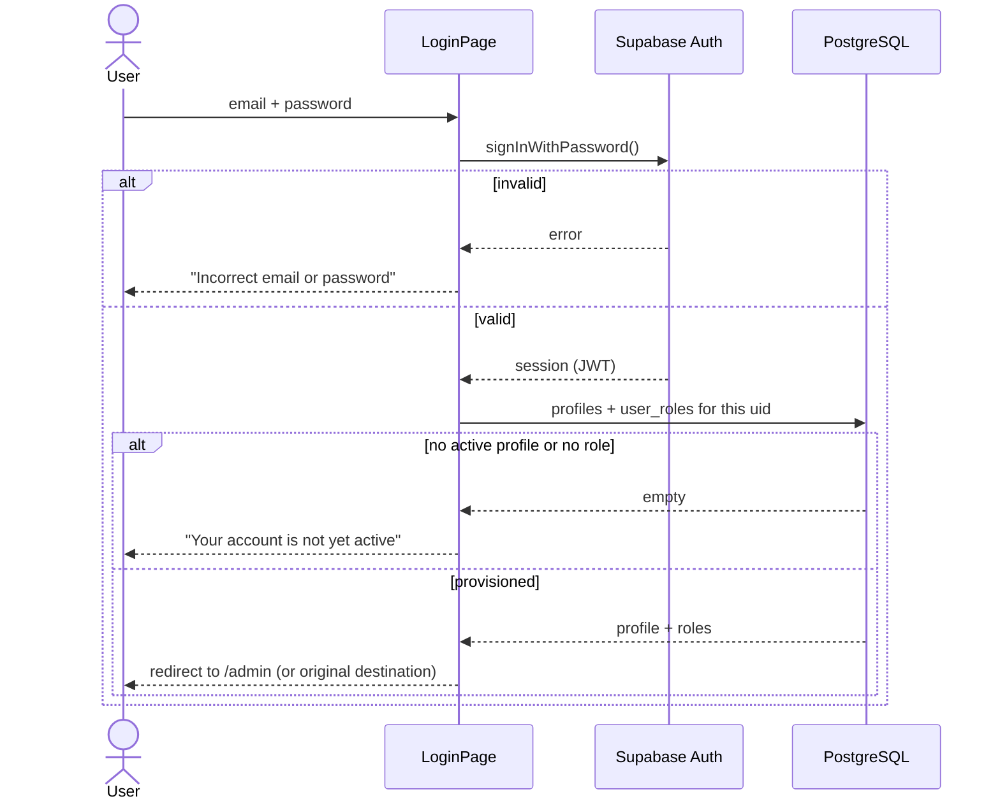
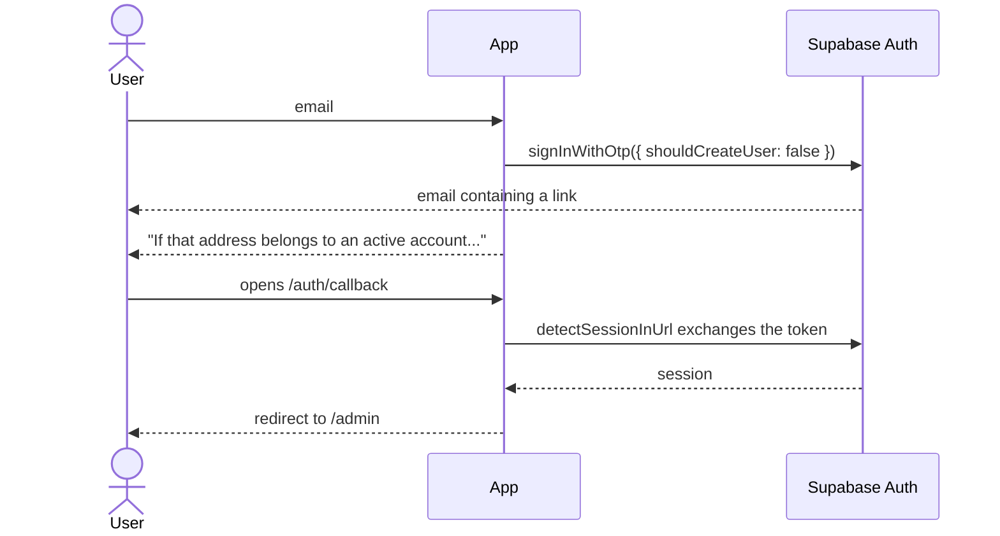
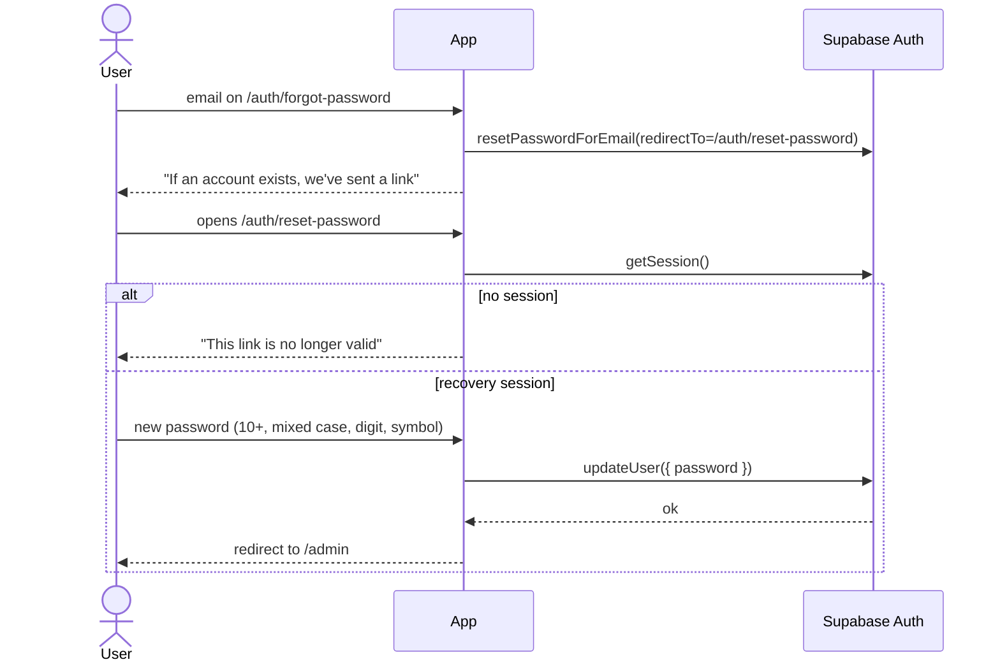
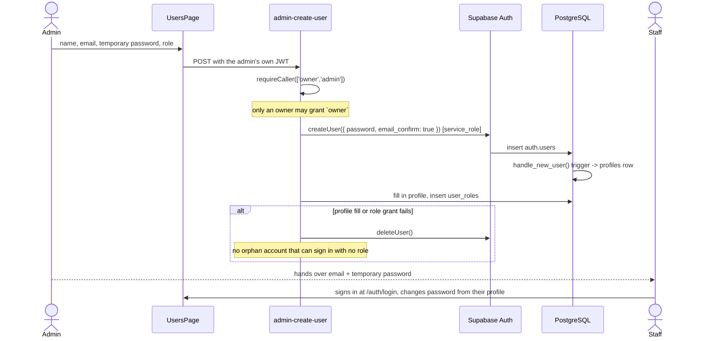

# Authentication flows

Supabase Auth handles credentials, sessions and tokens. This codebase never sees
a password.

Configuration: `supabase/config.toml`. Client: `src/lib/supabase.ts`. Session
state: `src/contexts/AuthContext.tsx`. Repository:
`src/features/auth/api/authApi.ts`.

---

## Client configuration

```ts
auth: {
  persistSession: true,
  autoRefreshToken: true,
  detectSessionInUrl: true,   // exchanges magic-link / invite / recovery tokens
  flowType: 'pkce',           // authorization code + PKCE, not implicit
  storageKey: 'aloha-auth',
}
```

PKCE means the token is exchanged server-side against a one-time code verifier,
so an access token never appears in a URL that could land in browser history or
a referrer header.

Session lifetime (`config.toml`): JWT 1 hour with rotating refresh tokens,
8-hour inactivity timeout, 24-hour absolute timebox.

---

## Password sign-in



The failure message is deliberately identical for "no such user" and "wrong
password". Distinguishing them would let anyone test which staff addresses
exist.

---

## Magic link



`shouldCreateUser: false` matters: without it, a magic link would silently create
an account on an internal system for any address typed into the box.

The confirmation wording is the same whether or not the address exists.

---

## Password reset



`ForgotPasswordPage` swallows the API error on purpose and always shows the
confirmation — same enumeration reasoning as above. Links expire after one hour
and are single-use.

---

## Staff creation

Creating an auth user requires the `service_role` key, which cannot be in the
browser. The flow therefore routes through an Edge Function.

No invitation email is involved: the admin sets a temporary password in the
form and the account is created already confirmed, so the new staff member can
sign in immediately with the credentials they are handed.



The function verifies the caller with the *user's* client (subject to RLS) and
only then acts with the admin client. A `SECURITY DEFINER`-equivalent path that
skipped that check would be a privilege escalation hole.

---

## Session bootstrap

`AuthProvider` on mount:

1. `getSession()` — restore from storage
2. If a session exists, load `profiles` and `user_roles` in parallel
3. Subscribe to `onAuthStateChange`

Three states, not two:

| State | Meaning | UI |
|---|---|---|
| `isLoading` | Session not yet resolved | "Checking your session…" |
| no `session` | Not signed in | Redirect to login, remembering the destination |
| `isUnprovisioned` | Valid session, but no active profile or no role | "Your account is not yet active" + sign out |

That third state is the one usually missed. Without it a deactivated user lands
on a dashboard where every query silently returns nothing, which reads as a bug
rather than as revoked access.

Two details in `AuthProvider` worth keeping:

- `TOKEN_REFRESHED` is ignored. It fires roughly hourly with the same identity;
  refetching the profile on it would be pure churn.
- An `activeUserId` ref guards the profile fetch, so a slow response cannot
  repopulate state for a session that has since signed out.

On `SIGNED_OUT` the entire TanStack Query cache is cleared — otherwise the next
user on a shared machine could see the previous user's cached applicant list.

---

## Roles in the client

```ts
const { hasRole, isAdmin, isStaff, roles } = useAuth()
```

These drive navigation and button visibility **only**. They are a usability
affordance: a user who edits their way past a guard reaches a page whose every
query returns empty or 403. Row Level Security is the boundary — see
[authorization-matrix.md](./authorization-matrix.md).

---

## Applicants are not users

Applicants never authenticate. They submit anonymously under an RLS policy that
pins the row to a fresh `pending` application, receive a reference number, and
track progress through `check_application_status(reference_no, last_name)` — an
RPC that requires two matching facts and returns no contact details.

This is deliberate. Accounts for thousands of applicants would be a large
credential surface protecting data they already have.
